As promised in the post on [CSSconf EU 2018](https://danielcaldas.github.io/posts/about-css-conf-eu-berlin-2018/) I will now talk a bit about the JSConf EU 2018 that followed the CSSConf in the Berlin Arena (June 2nd and 3rd).

#### What will you find here

- [Talks (in-depth coverage of selected talks)](#talks)
  - [Day 1](#day-1)
  - [Day 2](#day-2)
- [Other things I've learned](#other-things-ive-learned)
- [The venue](#the-venue)
- [Berlin](#berlin)

### Talks

As you're probably expecting the talks weren't exclusively technical (of course we got to see a few _hands on_ kind of presentation) topics ranged from ethics, productivity, history all the way to the more technical realm with performance, user experience, machine learning, IoT and of course the Javascript language itself <a href="https://2018.jsconf.eu/schedule/" target="_blank" title="jsconf eu 2018 berlin schedule">check out the conference full schedule</a>.

Now I'll focus on a few interesting talks that I had the change to see on each day, I'll give an overview on the content that was more meaningful (in my opinion of course). I'll break down the talks into <a href="#day-1" title="Day 1 talks">Day 1</a> and <a href="#day-2" title="Day 2 talks">Day 2</a>.

### Day 1

- [(1) Kablooie: A History of Errors & a Future of Solutions - Sarah Groff Hennigh Palermo - JSConf EU 2018](#d1t1) | <a href="https://www.youtube.com/watch?v=tteIQBPPxqc" target="_blank" title="Kablooie: A History of Errors & a Future of Solutions - Sarah Groff Hennigh Palermo - JSConf EU 2018">talk video</a>
- [(2) Native BigInts in JavaScript: A Case Study in TC39 - Daniel Ehrenberg - JSConf EU 2018](#d1t2) | <a href="https://www.youtube.com/watch?v=RiU5OzMZ7z8" target="_blank" title="Native BigInts in JavaScript: A Case Study in TC39 - Daniel Ehrenberg - JSConf EU 2018">talk video</a>
- [(3) Further Adventures of the Event Loop - Erin Zimmer - JSConf EU 2018](#d1t3) | <a href="https://www.youtube.com/watch?v=u1kqx6AenYw" target="_blank" title="Further Adventures of the Event Loop - Erin Zimmer - JSConf EU 2018">talk video</a>
- [(4) Hand-crafting WebAssembly - Emil Bay - JSConf EU 2018](#d1t4) | <a href="https://www.youtube.com/watch?v=CfdmzVos1Fs" target="_blank" title="Hand-crafting WebAssembly - Emil Bay - JSConf EU 2018">talk video</a>
- [(5) 10 Things I Regret About Node.js - Ryan Dahl - JSConf EU 2018](#d1t5) | <a href="https://www.youtube.com/watch?v=M3BM9TB-8yA" target="_blank" title="10 Things I Regret About Node.js - Ryan Dahl - JSConf EU 2018">talk video</a> | <a href="http://tinyclouds.org/jsconf2018.pdf" target="_blank" title="design mistakes in node slides">slides</a>

The opening talk was about errors [<span id="d1t1">(1)</span>](#day-1), yes errors. I've highlighted this topic because error handling is often forgotten or skipped but shouldn't this be part of the modelling process and architecture of our applications? Well that's another story.
Questioning type systems and discussing errors from a human perspective a pretty valid statement was pointed out
on Javascript error handling mechanism, **it is practically the same since it came out in <a href="https://codeburst.io/javascript-wtf-is-es6-es8-es-2017-ecmascript-dca859e4821c" target="_blank" title="JavaScript — WTF is ES6, ES8, ES 2017, ECMAScript… ?">ES3</a>**. Of course the language evolved in ways that try
to mitigate predictable runtime errors with static analysis, the ES5 brought along the <a href="https://developer.mozilla.org/en-US/docs/Web/JavaScript/Reference/Strict_mode" target="_blank" title="Strict mode">strict mode</a>, strict mode is basically (talk quote) _"disallow bad code that otherwise would be allowed according to the language grammar"_. Next a list of how typically errors are handled and here handled in the past was shown, from the classic _just crash_ classic to exceptions, signals, options/maybes....
Some conclusions here were:

- We need more robust way to deal with nullity (<a href="https://github.com/tc39/proposal-optional-chaining" target="_blank" title="tc39 optional chaining proposal">optional chaining tc39 proposal</a>)
- Expand ways to work with errors (e.g. _onError_ event listeners).
- Focusing on default arguments.
- Maintain good state in the face of user interaction while warning for events that caused transition to a bad one.

Other ideas that the speaker brought to discussion envolved <a href="https://users.ece.cmu.edu/~koopman/des_s99/sw_fault_tolerance/" target="_blank" title="cmu recovery blocks">recovery blocks</a> and <a href="https://www.microsoft.com/en-us/research/wp-content/uploads/2016/08/algeff-tr-2016-v2.pdf" target="_blank" title="microsoft technical report algebraic effects for functional programming">algebraic effects</a>.

---

Next <a href="https://twitter.com/littledan?ref_src=twsrc%5Egoogle%7Ctwcamp%5Eserp%7Ctwgr%5Eauthor" target="_blank" title="daniel ehrenberg twitter">Daniel Ehrenberg</a> talks to us about numbers [<span id="d1t2">(2)</span>](#day-1). So the problem is that number representation in Javascript are limited to 2^35, as in:

```javascript
const x = 2 ** 53;
// x is 9007199254740992
const y = x + 1;
// y is again 9007199254740992
```

According to this presentation _long/ulong_ types where proposed back there (1999) in some of the first ECMA specifications, still they didn't make till the very end. But why this limitation in numerical representation in Javascript. Numbers in Javascript are 64-bit floating point binary numbers (<a href="https://en.wikipedia.org/wiki/Double-precision_floating-point_format" target="_blank" title="wikipedia double-precision floating-point format">IEEE 754 64-bit floats</a>), and they're structure is:


<cite>souce: https://www.youtube.com/watch?v=RiU5OzMZ7z8</cite>

So the 2^53 maximum number (900719925474099**2**) looks like this when in the binary floating point representation:

> 0 10000110100 0...(x52)

Adding **1** we get:

> 0 10000110100 0...(x51)... **1**

that is 900719925474099**4**. So... Ok we get it, with a 64-bit representation it's impossible to represent all the numbers since you have the limitation of a 64-bit combination pattern to form numbers, at some point we need to round it, go up to infinity or throw an error.

But wait, is this a real use case? Yes, <a href="https://developer.twitter.com/en/docs/basics/twitter-ids.html" target="_blank" title="twitter developers twitter ids (snowflake)">checkout Twitter IDs (snowflake) issue</a> that made them add an `id_string` field so that when Javascript parses the id it keeps this unchanged id in the string format.
The proposed solution is <a href="https://github.com/tc39/proposal-bigint" target="_blank" title="tc39/proposal-bigint">_BigInt_</a>. Not some library such as <a href="https://github.com/indutny/bn.js/" target="_blank" title="BigNum in pure javascript">bn.js</a>, instead a native Javascript supported BigInt type.

```javascript
x = 2n ** 53n;
// x is 9007199254740992n
y = x + 1n;
// y is now 9007199254740993n
// note that if you try and add a number you will get a TypeError
y = x + 1;
// Uncaught TypeError: Cannot mix BigInt and other types, use explicit conversions
```

You can check the progress of the proposal at the github repository <a href="https://github.com/tc39/proposal-bigint" target="_blank" title="arbitrary precision integers in javascript">tc39/proposal-bigint</a>, it is at the time of this writing in stage 3.

In my opinion may solve huge corner cases as the one exposed previously, still I think it will make arithmetic operations less error prune since we can eventually now run into _TypeErrors_ for mixing numbers with BigInts. If BigInt is not explicit enough to developers we can start to fall into messy errors, but maybe I'm overreacting here.

---

[<span id="d1t3">(3)</span>](#day-1) You most certainly have seen the Philip Roberts' talk on the event loop <a href="https://www.youtube.com/watch?v=8aGhZQkoFbQ&t=4s" target="_blank" title="Philip Roberts: What the heck is the event loop anyway? | JSConf EU">_What the heck is the event loop anyway? | JSConf EU_</a>. If not, please stop reading this and watch that, it's way more important. In this next talk we dive into the event loop to learn that the event loop is a bit more complex than what you saw in Philip Roberts' talk.

To start we can think of the <a href="https://developer.mozilla.org/en-US/docs/Web/JavaScript/EventLoop" target="_blank" title="javascript mdn event loop">event loop</a> as the main function of the browser, something like:

```javascript
while (queue.waitForMessage()) {
  queue.processNextMessage();
}
```

A quick look into how task queues work on web browsers. So first _tasks_ are small unities of work to be executed from start to finish. Rendering pipeline in browsers is responsible for painting things in the browser. This pipeline can run when a task finishes, but the rendering pipeline has a separate time cycle and sometimes waiting is inevitable between the time a tasks finished and the time render pipeline runs again. Also if you have a task that takes really a long time to run the rendering pipeline has to wait, potentially your page will start to slow down at this point.

There are this things called micro-tasks (<a href="https://developer.mozilla.org/en-US/docs/Web/JavaScript/Guide/Using_promises" target="_blank" title="guide using promises mdn">promises' callbacks are handled as micro-tasks</a>). Micro-tasks are handled differently than regular tasks, micro-tasks are queued in a micro task queue, this queue runs after each task and while the queue is emptying other micro-tasks might be added and executed in the same event loop tick.


<cite>source: https://imgflip.com/memegenerator/13026863/TOYSTORY-EVERYWHERE</cite>

There's more. Animations have a dedicated queue as well the **animation frame callback queue**. When some animation tasks ends the event loop proceeds to the repaint, meaning that we don't wait up for new animation tasks that might appear, and it makes sense because if that happens it's because some animation was requested to be displayed in the next frame (thus in the next repaint).

At the end of these series of explanations we got the following pseudo code:

```javascript
while (true) {
  queue = getNextQueue();
  task = queue.pop();

  execute(task);

  while (microtaskQueue.hasTasks()) {
    doMicroTask();
  }

  if (isRepaintTime()) {
    animationTasks = animationQueue.copyTasks();

    for (task in animationTasks) {
      doAnimationTask(task);
    }

    repaint();
  }
}
```

And that should be it. **Now a quick peek into Node.js**. Node should be more simpler since:

- There are no scripting parsing events.
- There are no user interactions.
- There are no animation frame callbacks.
- There is no rendering pipeline.

A few interesting things:

- `setImmediate(callback)` is the same as `setTimeout(callback, 0)` but it runs first!
- `process.nextTick(callback)` all this callbacks will run before the promises callbacks.
- `setImmediate(callback)` does something on the next tick.
- `process.nextTick(callback)` does something immediately.

Below the pseudo-code for the Node event loop:

```javascript
while (tasksAreWaiting()) {
  queue = getNextQueue();

  while (queue.hasTasks()) {
    task = queue.pop();

    execute(task);

    while (nextTickQueue.hasTasks()) {
      doNextTickTask();
    }

    while (promiseQueue.hasTasks()) {
      doPromiseTask();
    }
  }
}
```

<small>
  (
  <a
    href="https://medium.freecodecamp.org/walking-inside-nodejs-event-loop-85caeca391a9"
    target="_blank"
    title="medium walking inside the node.js event loop"
  >
    this nice
  </a>{" "}
  article explains with more detail the event loop inside Node.js)
</small>

Regarding <a href="https://developer.mozilla.org/en-US/docs/Web/API/Worker" target="_blank" title="mdn web api worker">web workers</a> the only relevant fact pointed out is that they are simple to understand since each web worker runs it's own event loop on a separate thread and they are not allowed to manipulate DOM so no need to worry about user interactions here.

If you are interested in more of this you can check this very complete post <a href="https://jakearchibald.com/2015/tasks-microtasks-queues-and-schedules/" target="_blank" title="tasks, microtasks, queues and schedules">_Tasks, micro tasks, queues and schedules_</a>, it contains interesting animated demonstrations.

---

[<span id="d1t4">(4)</span>](#day-1) More than a year has passed since the release of <a href="https://developer.mozilla.org/en-US/docs/WebAssembly/Concepts" target="_blank" title="">WebAssembly (WASM)</a>, it is still in its first steps towards what could be a game changer in web development (some say). In the next talk that I will mention WASM itself was introduced. So first of all WASM:

- It's not very web, it's only pure computation.
- It's not very assembly, it's not the code that actually runs on the machine, it's an abstraction.
- In WASM we cannot perform system calls (unless with explicit access).
- WASM cannot access additional hardware, you can check a simple example below.
- <a
    href="https://developer.mozilla.org/en-US/docs/WebAssembly/Understanding_the_text_format"
    target="_blank"
    title="mdn wasm understanding the text format"
  >
    Web assembly text-format (WAT)
  </a> is the assembly language for WASM.

```wasm
(module
  (func $square
    (export "square")
    (param $x i32)
    (result i32)
    (return
      (i32.mul (get_local $x) (get_local $x))
    )
  )
)
```

That's enough WAT for now, you're probably wondering how can we use WASM modules within javascript. It's actually simple, you just have a small amount of boilerplate to load the WASM module. Let's import and use `square.wasm` module.

```javascript
fetch("square.wasm")
  .then((response) => response.arrayBuffer())
  .then((bytes) => WebAssembly.instantiate(bytes, importObject))
  .then((results) => {
    const square = results.instance.exports.square;
    const x = square(2);

    console.log(x); // 4
  });
```

Of course you probably won't be using many native WAT modules, you will compile your C, C++, Rust or whatever into WASM, using it the same way we did above.

I think a very strong point was a little too much implicit during this talk, performance was mentioned still, with WASM we will be able to obtain a **more robust and coherent performance cross platform/browser** and **portability across operating systems and different CPU architectures**.

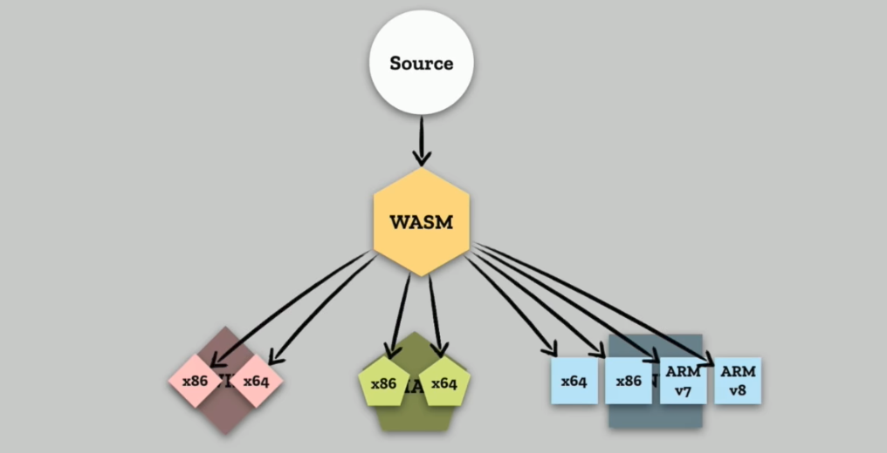

<Caption
  source="https://www.youtube.com/watch?v=bac0dGQbUto"
  text="As you can see WASM sits between our source code and creates an abstraction layer on top of the various CPU architectures. This diagram is from the talk, 'Dan Callahan: Practical WebAssembly | JSConf Budapest 2017'"
/>

If you want to look more into the benefits or what actually could be achieved with WASM I highly recommend the two following talks <a href="https://www.youtube.com/watch?v=PpuAqLCraAQ" target="_blank" title="real world webassembly chrome dev summit 2017">Real World WebAssembly (Chrome Dev Summit 2017)</a> and <a href="https://www.youtube.com/watch?v=bac0dGQbUto" target="_blank" title="dan callahan: practical webassembly jsconf budapest 2017">Dan Callahan: Practical WebAssembly | JSConf Budapest 2017</a>.

---

I couldn't have imagined a better talk to end day 1 [<span id="d1t5">(5)</span>](#day-1). On stage we had <a href="https://en.wikipedia.org/wiki/Ryan_Dahl" target="_blank" title="ryan dahl wiki page">Ryan Dahl</a> inventor of Node.js.
First Ryan gives us a bit of context on the talk, like how we wanted to build better servers with event-driven non-blocking I/O, and why dynamic languages are great (for certain kind of tasks), being Javascript the best dynamic language.

The talk had the following introduction:

> _"(...) using Node now looks like nails on chalkboard to me, I see the bugs that I introduced, I mean at this point they are not really bugs it's just how it works, but they are bugs. They were design mistakes made that just cannot be corrected now because there's so much software that uses it (...) It offends my sensibilities (...)"_


<cite>source: https://www.youtube.com/watch?v=M3BM9TB-8yA</cite>

So let's take look at the mentioned regrets:

- **Not sticking with Promises** - promises were added very earlier, but Ryan decided to remove then because Node.js aim was to be minimalist;
- **Security** - Javascript is a very secure sandbox, unfortunately in Node we just bound to everything, not safe. Networking access for instance is given by default.
- **The build system (GYP)** - probably the biggest regret. Chrome used to use GYP, now it uses GN. There are several wrappers around this (e.g. node-gyp) which brings layers of unnecessary complexity and terrible experience for users.
- **package.json** - allowing `require()` in Node semantics to look into `package.json` and look through files, this made `package.json` necessary to node applications, so we ended up with a centralized repository for modules. Ultimately NPM was included in the Node distribution.
- **node_modules** - if you have multiple projects it tends to have multiple `node_modules` folders... It gets big.
   without the extension .js** - at some point someone thought that requiring files without the extension would be cleaner, so you just end up trying to look up the extension in the filesystem, it is `.js`? `.jsx`? `.ts`? Well in this one I agree with Ryan just write down the f\*\*\* extension!
- **index.js** - Ryan thought it was cute. There was `index.html` and in the same wave of thinking it should be cute to have an `index.js` why not? Well it ends up that this raised complexity of the module loading system unnecessarily.
- **How user code is managed by the module system** - As Ryan was developing Node he focuses mainly on _evented_ I/O leaving some things behind, one of them was the module system and how it manages user code.

And then a plot twist. At the end of complaining about Node.js Ryan presented a possible alternative to Node.js and how it could be better.

The alternative? <a href="https://github.com/denoland/deno" target="_blank" title="A secure TypeScript runtime on V8">deno</a>, a a secure TypeScript runtime on V8. The main goals of deno are **security**, **simplicity of the module system** and **support typescript out of the box**.

### Day 2

- [(1) To push, or not to push?! - The future of HTTP/2 server push - Patrick Hamann - JSConf EU 2018](#d2t1) | <a href="https://www.youtube.com/watch?v=cznVISavm-k" target="_blank" title="To push, or not to push?! - The future of HTTP/2 server push - Patrick Hamann - JSConf EU 2018">talk video</a>
- [(2) TC39 Panel - JSConf EU 2018](#d2t2) | <a href="https://www.youtube.com/watch?v=Hj5q8uyqGYc" target="_blank" title="TC39 Panel - JSConf EU 2018">talk video</a>
- [(3) JavaScript Engines: The Good Parts™ - Mathias Bynens & Benedikt Meurer - JSConf EU 2018](#d2t3) | <a href="https://www.youtube.com/watch?v=5nmpokoRaZI" target="_blank" title="JavaScript Engines: The Good Parts™ - Mathias Bynens & Benedikt Meurer - JSConf EU 2018">talk video</a>
- [(4) Imagine This: A Web Without Servers - Tara Vancil - JSConf EU 2018](#d2t4) | <a href="https://www.youtube.com/watch?v=rJ_WvfF3FN8" target="_blank" title="Imagine This: A Web Without Servers - Tara Vancil - JSConf EU 2018">talk video</a>
- [(5) Deep Learning in JS - Ashi Krishnan - JSConf EU 2018](#d2t5) | <a href="https://www.youtube.com/watch?v=SV-cgdobtTA" target="_blank" title="Deep Learning in JS - Ashi Krishnan - JSConf EU 2018">talk video</a>

[<span id="d2t1">(1)</span>](#day-2) First talk we'll see on day two is strictly related with JS it's a more broader theme in regards of performance and how can we improve resource loading, let's get to know a few of this technique and show that <a href="https://http2.github.io/" target="_blank" title="This is the home page for HTTP/2, a major revision of the Web's protocol">HTTP/2</a> solo will not solve all your performance problems.

> HTTP/2 will solve this.

HTTP/2 will certainly bring speed to the web, but the thing is that **resource loading in the browser is hard**. Performance is tighly coupled to latency, speed of light will not get any faster, TCP handshakes will not go away as well as TCP congestion mechanisms that penalizes us at the beginning of every connection.
The way that browsers and servers interact does not allows us to take the best performance on resource loading.

> What are critical resources?

> A critical request is one that contains an asset that is essential to the content within the users' viewport.

A good loading strategy:

- Prioritizes above-the-fold rendering.
- Prioritizes interactivity..
- It's easy to use.
- It's measurable.

So let's look into some techniques...

#### Preload

What if we could tell the browser upfront what are the resources that we want to load?
Resources as fonts are know are **critical hidden sub-resources** since we only know of their existent after the browser executes a few steps:

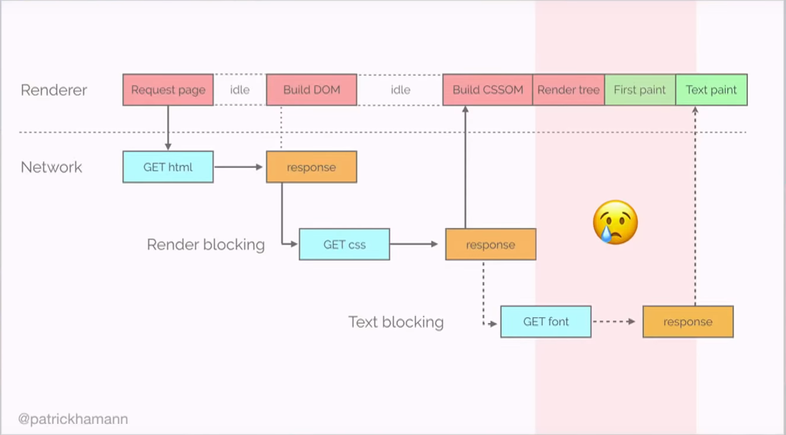
<cite>source: https://www.youtube.com/watch?v=cznVISavm-k</cite>

1. Get request homepage (browser will start to construct the DOM under the hood)
2. Stysheets and script tags referenced in the page are found. CSS is render blocking thus we need to wait for all the bytes to come down
3. CSS gets downloaded and then CCS Object Model and the DOM are combibed to form the render tree
4. We have a render tree. Browser will dispatch font requests here.

What if we could:

> Provide a declarative fetch primitive that initializes an early fetch and separates fetching from resource execution.

So you can, preload with HTTP header:

```bash
Link: <some-font.woff>; rel=preload; as=font; crossorigin
```

Or with markup:

```html
<link rel="preload" href="/styles.css" as="style" />
```

<br />
<br />

> Shopify switch to preloading fonts saw 50% (1.2 sec) improvement in time-to-text-paint.

<br />
<br />

#### Server push

Imagine the following scenario:

The connection will be left for a while (red area) while the server is thinking, this will specially be the case if you have a server-side rendered application.

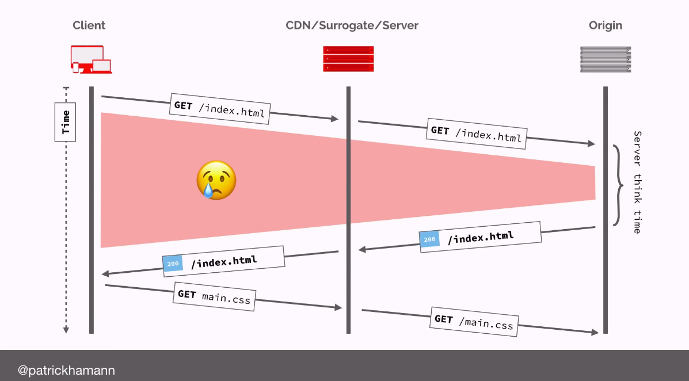
<cite>source: https://www.youtube.com/watch?v=cznVISavm-k</cite>

But, what if the server could predict that the next required asset from the browser will be the `main.css` file?
Image the browser could send this at soon as it receives the first request.

```bash
Link: <font.woff2>; rel=preload; as=font; crossorigin # indicate push via preload Link header
Link: <main.css>; rel=preload; as=style; nopush # use no push to disable push semantics and only use preload
Link: <application.js>; rel=preload; as=style; x-http2-push-only # disable preload semantics with x-http2-push-only
```

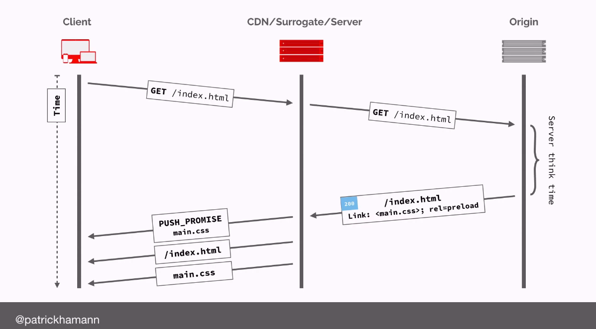
<cite>source: https://www.youtube.com/watch?v=cznVISavm-k</cite>

If you're server is HTTP/2 enable, it will read the above configs and initiate the pushes for you.
Benifits? In Europe saving this 1 round trip time in a 3G connection could save us as much as 800ms.

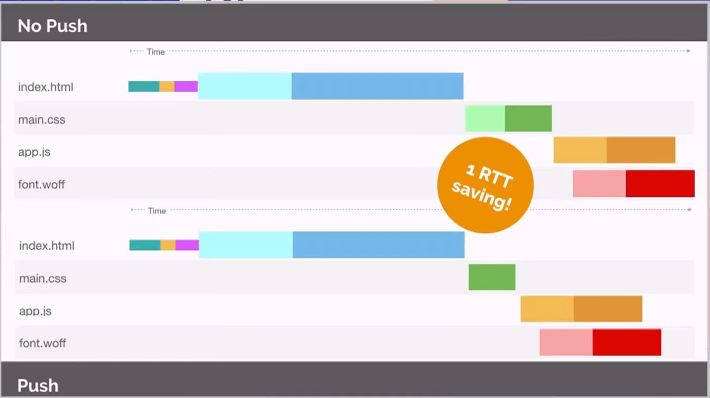
<cite>source: https://www.youtube.com/watch?v=cznVISavm-k</cite>

But notice we still have an idle time at the beginning of the connection in `index.html`. This idle time happens because **only when we fully send the index.html, only then we initialize the push**.

#### Async push

The goal here is to decouple the pushing behavior from our application HTML response starting the push right at the beginning of the connection flow.

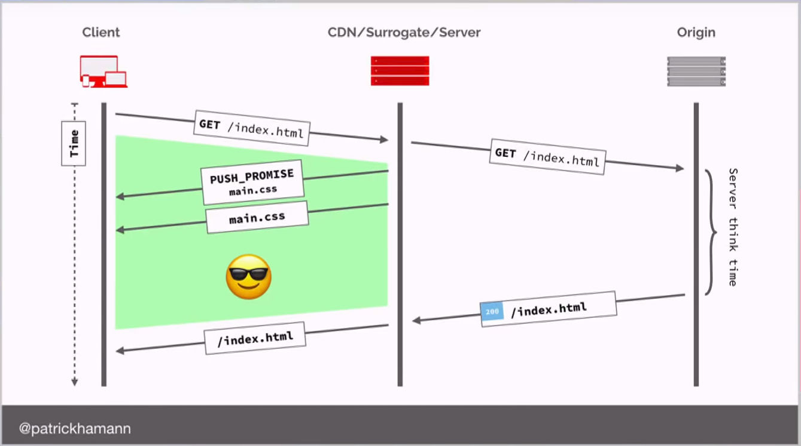
<cite>source: https://www.youtube.com/watch?v=cznVISavm-k</cite>

Notice that we don't need to wait for the server to receive send out the `index.html`, simply by knowing that the `index.html` was requested we can start to push resources! Below simple snippet on how to achieve this with Node.js.

```javascript
const http2 = require("http2");

function handler(request, response) {
  if (request.url === "index.html") {
    const push = response.push("/critical.css");
    push.writeHead(200);
    fs.createReadStream("/critical.css").pipe(push);
  }

  /**
   * Generate index response:
   * - Fetch data from DB
   * - Render some template
   * etc.
   */

  response.end(data);
}

const server = http2.createServer(opts, handler);
server.listen(80);
```

Again, benefits?

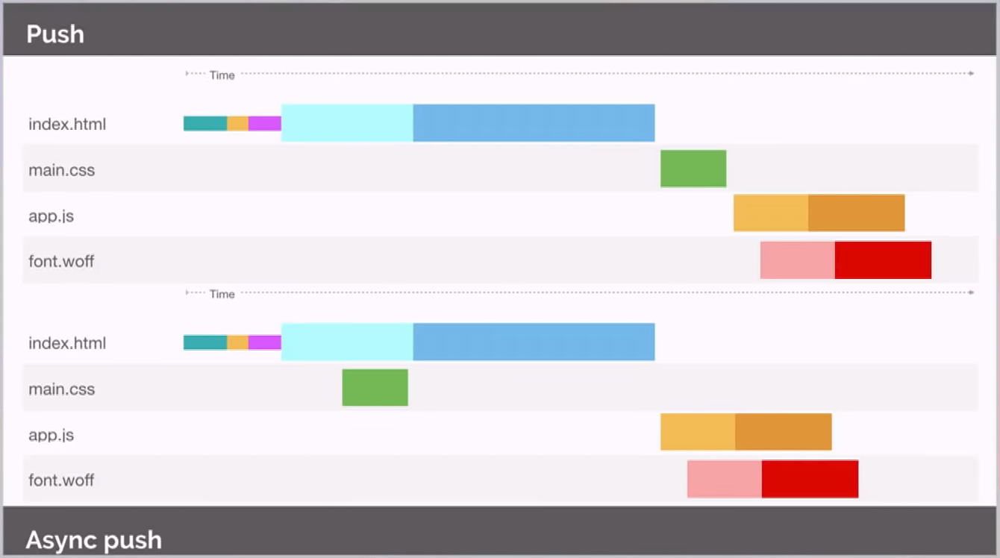
<cite>source: https://www.youtube.com/watch?v=cznVISavm-k</cite>

#### But why is nobody adopting it?

**Cache**. The browser has the ability to say _"Please don't send me that `main.css` already got it in my cache."_, but with HTTP/2 push what happens is that by the time the browser is saying this we have already sent the `main.css`, so we have a race condition here!

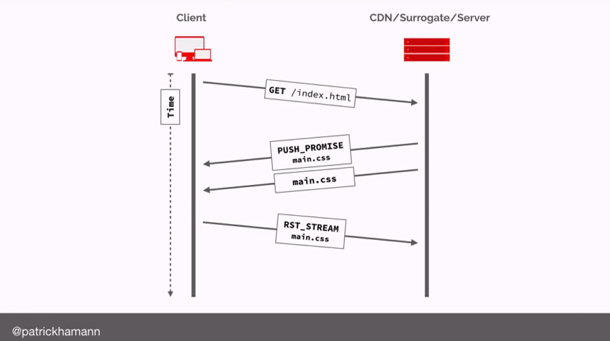
<cite>source: https://www.youtube.com/watch?v=cznVISavm-k</cite>

Yet another blog post by Jake Archibald is mentioned in this talk, if you want to go with HTTP/2 into production checkout <a href="https://jakearchibald.com/2017/h2-push-tougher-than-i-thought/" target="_blank" title="HTTP/2 push is tougher than I thought">HTTP/2 push is tougher than I thought</a>.

Also, the lack of adoption of push has made some vendors think in removing push from the HTTP/2 specification.

#### When should I push?

- You have long RTTs or server processing
- You can use async push
- You have client-rendered app shell (<a href="https://developers.google.com/web/fundamentals/performance/prpl-pattern/" target="_blank" title="PRPL pattern">**PRPL** - **P**ush, **R**ender, **P**re-cache and **L**azy-load</a>)
- You control the client (native, Electron etc.)

#### The Future

##### Cache digest (CACHE_DIGEST)

Fix the racing condition between push and browser cache. The browser sends information about what content has in cache so that server can decided what to push! You can check the _CACHE_DIGEST_ specification <a href="https://tools.ietf.org/html/draft-kazuho-h2-cache-digest-00" target="_blank" title="draft of Cache Digests for HTTP2">here</a>.

##### 103 Early Hints

All this seems very complex, we need to maintain state. But HTTP is special and known for being stateless. The proposal of the new code <a href="https://evertpot.com/http/103-early-hints" target="_blank" title="103 Early Hints">_103 Early Hints_</a> is kind of a inversion of control compared to the _CACHE_DIGEST_ this time the server will tell the browser upfront what resources are available for download, this is a small reply only containing headers and it happens of course before or within the _server think time_.

```bash
HTTP/1.1 103 Early Hints
Link: </main.css>; rel=preload; as=style;
Link: </main.js>; rel=preload; as=script;
Link: </application-data.json>; rel=preload; as=fetch
```

In the speakers' opinion this is a lot more powerful than push since we're moving the decision process back to the browser.

##### Priority Hints

Allow us to decorate our HTML in ways that we are able to prioritize resources explicitly with <a href="https://github.com/WICG/priority-hints" target="_blank" title="WICG/priority-hints">priority hints</a>:

```html


```

<br />

#### Resource priorities checklist

- ✔️ Identify critical resources
- ✔️ Preload hidden sub-resources
- ✔️ Preconnect critical third-parties
- ❌ Avoid pushing with preload
- ⚠️ Use async push with care
- 🚀 Decorate HTML with priority hints
- 🚀 Use Early Hints when available

---

[<span id="d2t2">(2)</span>](#day-2) A very enlightening moment was the conversation and _Q&A_ session with the <a href="https://github.com/orgs/tc39/people" target="_blank" title="TC39 github">TC39 panel</a>. Not only I got an insider perspective on how things work within the ones behind for the mediation of ECMAScript specification but got to ear some of the upcoming new exciting features for Javascript. I'll leave below a resumed transcription of the most relevant discussed topics during the _Q&A_ session.

#### (Q) How does TC39 works?

TC39 is a committee of delegates how are representing members in ECMA international, they get together every 2 months for 3 days to discuss what proposals are up discuss what changes were in made. They operate on consensus which means that we all have to agree for something to move forward which is pretty unique in programming standards.
Then there's the proposal process, that works like this:

- **Stage 0** is a pseudo stage, an idea, the proposal exists.
- **Stage 1** is where the committee has considered that the proposal is something worth to move forward and find a solution for it.
- **Stage 2** is where there is a draft, a specification that identifies what the behavior should be.
- In **Stage 3** some browsers and other engines should already have implemented this feature.
- At **Stage 4** it's ready, and it should have already at least two shipping implementation in major browsers.

#### (Q) Other languages use the `private` keyword for private members. How did we end up with the `#` for private methods and property access?

There is two different things here. Private declaration and private access. Since javascript is not statically typed you cannot at runtime tell whether or not some given property is private or public. Then we ended with the `#` to declare and access private properties, you can think of the `#` as part of the name of the property like for instance:

```javascript
class SomeClass {
  constructor(prop) {
    this.#prop = prop;
  }

  getProp() {
    return this.#prop;
  }
}
```

These is a class feature that is part of a series of related separated proposals (that could possible merge into each other in the future or even break into more specific ones):

- <a
    id="proposal-private-fields"
    href="https://github.com/tc39/proposal-private-fields"
    target="_blank"
    title="A Private Fields Proposal for ECMAScript"
  >
    tc39/proposal-private-fields
  </a>
- <a
    href="https://github.com/tc39/proposal-class-fields"
    target="_blank"
    title="Orthogonally-informed combination of public and private fields proposals"
  >
    tc39/proposal-class-fields
  </a>
- <a
    href="https://github.com/tc39/proposal-private-methods"
    target="_blank"
    title="Private methods and getter/setters for ES6 classes "
  >
    tc39/proposal-private-methods
  </a>

#### (Q) What is javascript identity? Are we moving towards other non strongly typed programming languages with object oriented programming (e.g. with the introduction of es6 classes)? Or more functional? What are we aiming for?

The idea it's to get the best of both worlds. Other languages such as Rust or Swift are largely influenced by both object oriented and functional paradigms.

#### (Q) What's the relationship between Javascript WASM as compile targets?

**Javascript and WASM are complementary** as compile targets, so for some of the features that don't make sense in Javascript you can actually use WASM as the home for that feature where it could make more sense.

#### (Q) Can you show yours perspective on the flatten vs smoosh debate?

There was a proposal to add `flatten` and `flatMap` to the Array prototype. Is was implemented and shipped by Mozilla, but soon they realize tha this was breaking certain web pages. Basically some web pages were relying on certain implementations not being there, this if of course the worst that can happen to a proposal, we don't want to break the web. So we rollback and we knew that we needed to change the proposal in some way. In this case because the name itself was a problem (`flatten`) we had to rename it somehow... The proposal author decided to send a <a href="https://github.com/tc39/proposal-flatMap/pull/56" target="_blank" title="tc39/proposal-flatMap rename flatten to smoosh">_joke pull request_</a> with a rename to `smoosh` and `smooshMap`, but it was not clear that this was a joke so... everybody freaked out.

#### (Q) What are some of the awesome features coming up next?

- <a href="https://github.com/tc39/proposal-optional-chaining" target="_blank" title="tc39/proposal-optional-chaining">
    Optional chaining
  </a>
- <a href="https://github.com/tc39/proposal-pattern-matching" target="_blank" title="tc39/proposal-pattern-matching">
    Pattern matching
  </a>
- <a href="#proposal-private-fields" title="Class features">
    Class features (private and public class fields)
  </a>
- <a href="#d1t2" title="Native BigInts in JavaScript: A Case Study in TC39 - Daniel Ehrenberg - JSConf EU 2018">
    BigInts
  </a>

#### (Q) What about a native method for deep object cloning?

Good idea, but very complex. 😎

#### (Q) What's the medium turn around for a proposal to become reality?

**Some** of them **take years**, but **at least a year to 18 months** it's a more realistic estimation.

---

[<span id="d2t3">(3)</span>](#day-2) A vital part of the Javascript runtimes are engines. <a href="https://github.com/v8/v8" target="_blank" title="The official mirror of the V8 Git repository">V8</a> is the Javascript engine for Chrome, Electron and Node.js. In the next talk we'll look into fundamental parts that are common to V8 and all other major Javascript engines:

- <a href="https://developer.mozilla.org/en-US/docs/Mozilla/Projects/SpiderMonkey" target="_blank" title="SpiderMonkey">
    SpiderMonkey
  </a> powers Firefox.
- <a
    href="https://github.com/Microsoft/ChakraCore"
    target="_blank"
    title="ChakraCore is the core part of the Chakra Javascript engine that powers Microsoft Edge
"
  >
    Chakra
  </a> for Microsoft Edge.
- <a
    href="https://developer.apple.com/documentation/javascriptcore"
    target="_blank"
    title="JavaScriptCore
"
  >
    <b>J</b>ava<b>S</b>cript<b>C</b>ore (JSC)
  </a> powers Safari and also React Native applications.

(Aside note, if you want to run Javascript directly in several engines you can install <a href="https://github.com/GoogleChromeLabs/jsvu" target="_blank" title="JavaScript (engine) Version Updater">jsvu</a>.)

All engines have this similar base architecture.

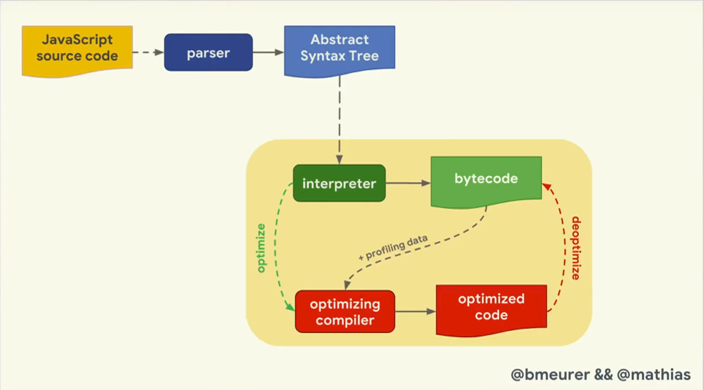
<cite>source: https://www.youtube.com/watch?v=5nmpokoRaZI</cite>

Regarding the important part (yellow square in the middle with interpreter and optimizing compiler) below are the main differences pointed for every Javascript engine:

- V8 is represented in the above diagram with one optimizer compiler.
- SpiderMonkey has 2 optimizer compilers, so this is like a 2 staged optimization.
- ChakraCore it's somehow similar to SpiderMonkey with 2 optimizer compilers.
- JSC has 3 optimized compilers taking the number of optimization layers to the space.

So we can already see the that the base architectural components for a Javascript engines are: **parser**, **interpreter** and **compiler pipeline**.

Now, the most interesting part is around Objects and how they are represented within engines. So Objects are basically dictionaries like in the following image.

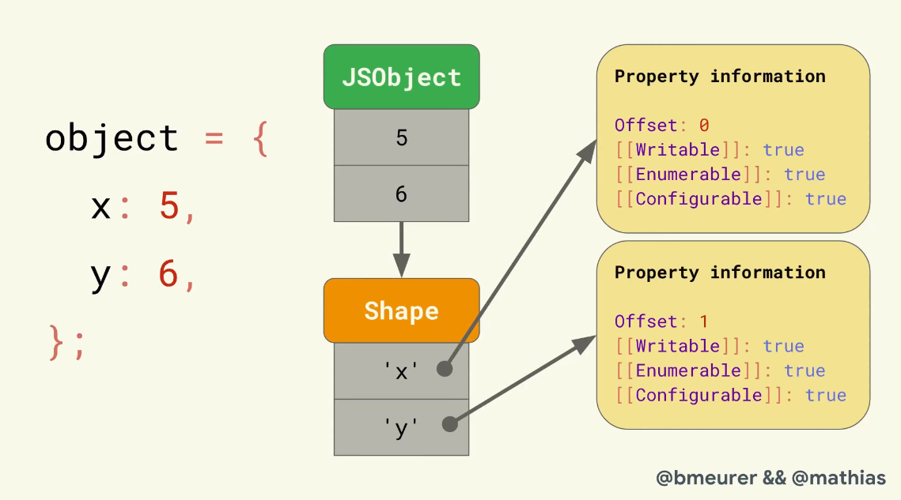
<cite>source: https://www.youtube.com/watch?v=5nmpokoRaZI</cite>

So an object has this string attributes that map to the value and metainformation of that property the **property attributes** according to the ECMAScript language specification. What do they mean this property attributes:

- **Value** of the property, nothing much to say here.
- **Writable** determines whether if the property can be reassigned to.
- **Enumerable** means that the property can appear in `for in` loops.
- **Configurable** means that is a _deletable_ property.

You can access this them in Javascript with:

```javascript
Object.getOwnPropertyDescriptors(someObject);
```

So another interesting fact around Objects is that they store they metainformation on a separate data structure so that the actual object only contains the values and a pointer to that data structure. The data structure that contains all the metainformation is called **Shape** (in SpiderMonkey, other engines have other names but hey are misleading. The computer science term for this is _hidden class_).

Know let's check how object declaration and property access are optimized in engines. Basically they build a doubled linked tree like structure that defines all possible shapes and each new added property only stores metainformation regarding itself. The `Offset` just tells you where you will find the property within the JSON object.

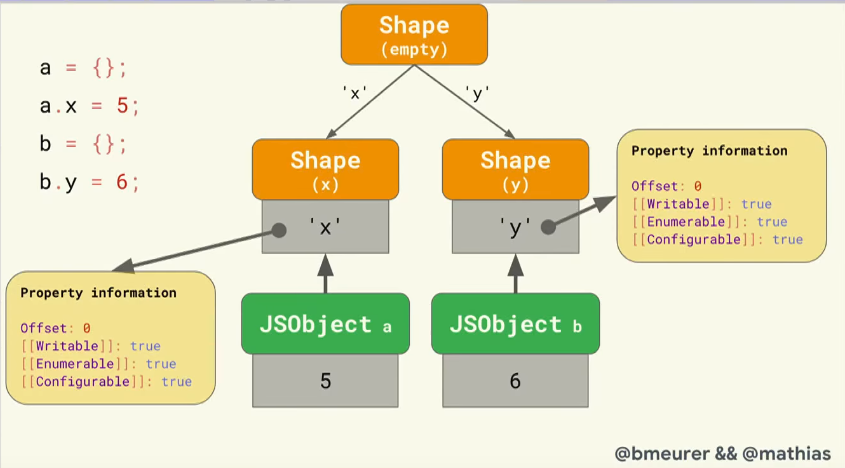
<cite>source: https://www.youtube.com/watch?v=5nmpokoRaZI</cite>

But! This isn't always the case it turns out that for cases where you have already a shape that derives from a base object, but then you go and initialize some object in a different way (e.g. with some properties already), the engine will create a new shape as it is more efficient for engines to keep the shape's structures the smallest as possible. As you can see in the next picture a new shape will be created despite property `x` being already in the first shape chain.

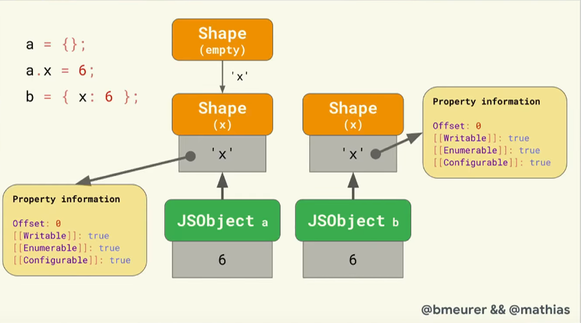
<cite>source: https://www.youtube.com/watch?v=5nmpokoRaZI</cite>

Then the main motivation for engines to have shapes is <a href="https://mathiasbynens.be/notes/shapes-ics#ics" target="_blank" title="JavaScript engine fundamentals: Shapes and Inline Caches by Mathias Bynens">inline cache (IC)</a>. This mechanism stores information about where to find properties within an object so that we can optimize the property look up. Basically for a given retrieved property it stores the offset where the property was found inside the shape, that way you can skip the fetch of the property metainformation to get the offset, you just access it right away!

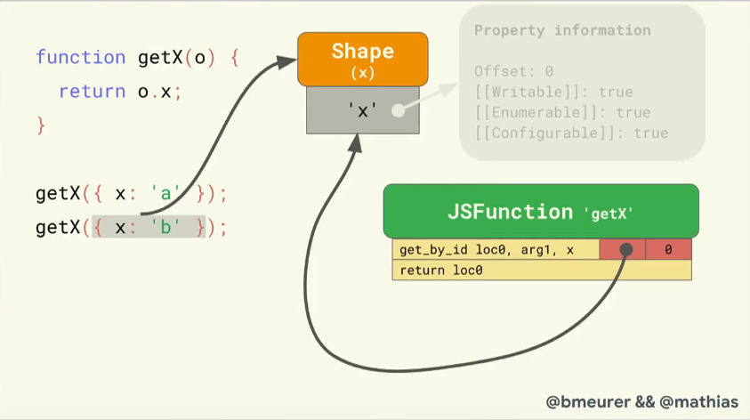
<cite>source: https://www.youtube.com/watch?v=5nmpokoRaZI</cite>

At the end two important notes:

- **Always initialize objects in the same way** so that engines can maximize the reuse of shapes.
- **Don't mess with the property attributes of array elements** so that they can be stored and operated upon efficiently.

(**Note**: I skipped arrays in the above talk as they are handled in similar ways and with similar mechanisms compared to objects.)

---

On this second day I would also like to mention two more talks, _A Web Without Servers_ [<span id="d2t4">(4)</span>](#day-2) because Beaker browser a peer-to-peer browser was presented here with a decentralized web in mind. Also _Deep Learning in JS_ [<span id="d2t5">(5)</span>](#day-2) because machine learning is a pretty hot topic and we should highlight the fact that <a href="https://js.tensorflow.org/" target="_blank" title="A JavaScript library for training and deploying ML models in the browser and on Node.js">TensorFlow.js</a> already available **which makes Javascript even more broad in terms of its applications**.

---

#### Other things I've learned

<small>(⚠️ randomly presented)</small>

> _"Whenever you are designing a program, there are things that you think it might be cute to add in... **You always regret those**. If they are unnecessary and simply cute, don't do them!"_ (_Ryan Dahl_)

- There is this new thing out there called <a href="https://github.com/denoland/deno" target="_blank" title="A secure TypeScript runtime on V8">deno</a>.
- If you throw an error inside a nested throw clause the outside catch will not be executed. In a similar fashion if you reject a promise passing in a throw statement the catch will not evaluate as in:

```javascript
function justThrowAnErr() {
  throw new Error("some error message");
}

function fetchSomeRainbows(nRainbows) {
  if (!nRainbows) {
    return Promise.reject(justThrowAnErr());
  }
  return Promise.resolve("here u go");
}

fetchSomeRainbows().catch((rainbowError) => console.log("unable to fetch rainbows"));

// this will output: "Error: some error message"
// instead of "unable to fetch rainbows"
```

- Facebook has built an ultra fast javascript bundler for React Native, if you are into this stuff you have
  probably heard about <a href="https://facebook.github.io/metro" target="_blank" title="metro The JavaScript bundler for React Native">metro</a>.
- When using:

```html
<a href="" target="_blank" title=""><main></a>
```

you will want to set a `role="main"` attribute if you want to support IE11.

- One should add `role="banner"` on your main header not to be confused with other headers that you might
  have.
- Do you develop your features for accessibility? I mean can a disable person you only uses the keyboard use your web site/app? This question made me think.
- You can practically do everything with Javascript today and people are serious about this.
- I didn't know much about the browsers internals (e.g. event loop task queues), but after this conference at least I'm aware of how much I don't know about it 😎.

## The venue

So, the event toke place at the Berlin Arena, an old building/factory kind of _hipster_ place, very cool and very hot by that time of the year! Good thing water was free of charge and could be reached by a few steps from almost any place inside the arena. So yeah despite the cool space and stage set up, there where always free soft drinks (and frozen yogurt!) around to make sure one's never dehydrate. Talking about stage, aside the unbearable heat, the space was pretty cozy with round tables so that people could have laptops and other stuff on the table while assisting to the talks. Also worth mentioning, there were a few electronic music live performances by <a href="https://twitter.com/nested_loops?lang=en" target="_blank" title="nested_loops twitter">nested_loops</a> and <a href="http://livejs.network/" target="_blank" title="live:js official website">live:js</a>, the sound and the visual effects played nicely producing <a href="https://www.youtube.com/watch?v=dPWRaN2PXZw" target="_blank" title="live:js opening performance youtube">a great show</a>.


<cite>source: https://2018.jsconf.eu/news/photos/</cite>

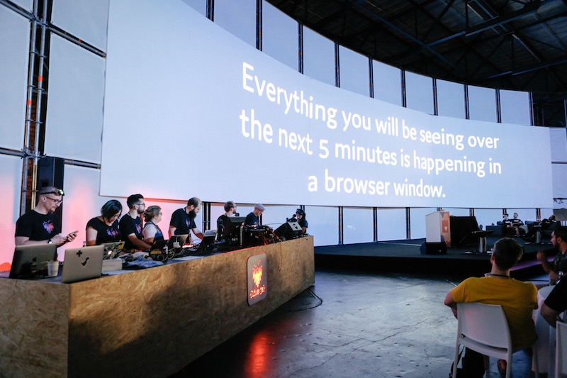
<cite>source: https://2018.jsconf.eu/news/photos/</cite>


<cite>source: https://2018.jsconf.eu/news/photos/</cite>

Throughout the venue there were exhibition stands of the sponsor companies, aside the _goodies_ you could see products demonstration, talk to people about the company or even get a job interview.

Breakfast, lunch and dinner where included in the ticket, so we (me and my colleagues) agreed that it would be worth and try and so we venture into the vegan world (for me practically unknown at the time). The food was nice I mean, I had the opportunity to try a few dishes such as vegan hamburger, vegan gnocchi, vegan pasta, you get it...


<Caption text="Gnocchi Pesto" />


<Caption text="Vegan Risotto" />

At the end of the day, we just grabbed a bear near the river and enjoy the remaining sunshine (no, we could not use the pool).


<Caption />

## Berlin

You know Berlin right? The capital and largest city in Germany, also one of the largest and multicultural cities in Europe. Despite the conference busy schedule I took sometime (mainly my last day) to visit a few of the high rated places in Berlin such as the museum island, the Berlin Cathedral, the Brandenburg Gate, Checkpoint Charlie and a few other spots. It is really worth visiting, besides the obvious places that you would wanna check as the ones mentioned previously Berlin has a great urban structure with organized and large street blocks composed by beautiful buildings, huge and various green spaces and of course an endless nightlife cater for all tastes.

And this is me (_left_) and my colleagues on our last day in Berlin.


<Caption />

See you soon.
