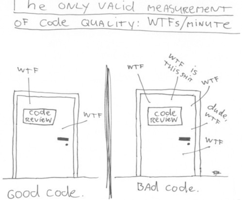
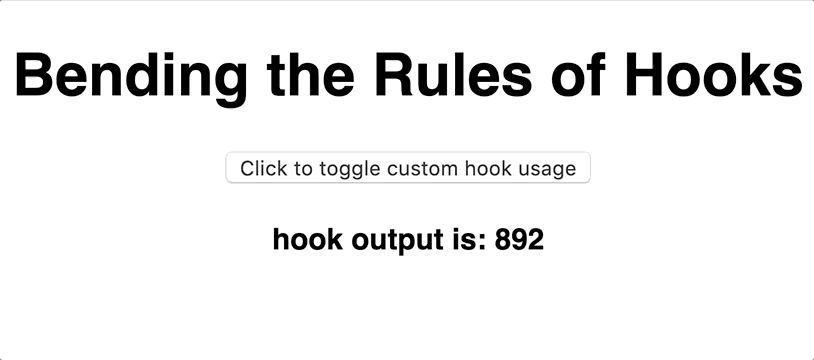

### tl;dr

- Calling hooks conditionally breaks the rules, yes.
- Wrap the hook with a component and render that component optionally to toggle the usage of the hook.
- The rules of hooks are somewhat reflections of the constraints of this React API.
- Example final full code [here](#example-full-code).


<cite>source: https://www.flickr.com/photos/sameli/1898511953"</cite>

### Bending the Rules

There's a <a href="https://reactjs.org/docs/hooks-rules.html" target="_blank" title="Rules of Hooks - React">bunch of reasons why you can't use a React hook conditionally</a> under a particular condition.

Before I start, I would like you to take a moment to reflect on the following questions?

**Why did you end up needing this? And, is it your fault, or is it the library's fault?**

. <br />
. <br />
. <br />
. <br />
. <br />
. <br />
. <br />
. <br />
. <br />
. <br />
. <br />
. <br />
. <br />
. <br />
. <br />
. <br />
. <br />
. <br />
. <br />
. <br />
. <br />
. <br />
. <br />
. <br />
. <br />
. <br />
. <br />
. <br />
. <br />
. <br />
. <br />

When I first tried to answer the question myself, I settled that it would be my fault If I had written the code since the very beginning.
If you pick React hooks API, you should structure the code accordingly not to end up falling into such scenarios where your better option might be breaking the rules. On the other end, if you have hundreds of components combined in a large shared codebase, you might hit a dead end where the most optimal option for the time being it's not beautiful. Still, it gets the job done and buys you and your team time to get things out faster, ideally you would come back and remove the hack later. Still, most of the time in the real world, we know that's not going to happen, so you better documenting it properly to alleviate the unavoidable spike on _WTFs/minute_ (got this from <a href="http://cleancoder.com/products" target="_blank" rel="nofollow" title="Uncle Bob Martin">Clean Code by Robert C. Martin</a>).


<cite>source: https://www.osnews.com/story/19266/wtfs</cite>

As always, I think there's nothing better than an example to explain a concept, let's look into one.

In this example, we have a custom hook `useRandomNumberEverySecond` that produces a random number every one second. In a real scenario, you could potentially have a super sophisticated hook that performs asynchronous stuff like data fetching and puts everything together. For the sake of simplicity, we're just returning a number.

We want only to call on `useRandomNumberEverySecond` and use its result, if and only if, a flag `isHookActive` has value `true`. But, how can we achieve this if we declare hooks at the top level of a component, and we can't wrap them inside `if` statements?

My suggested approach is to wrap our hook `useRandomNumberEverySecond` in a second component, `RandomNumberWrapper`, that mediates the relationship between our target component and the hook `useRandomNumberEverySecond`. Let's see how that looks.



As proof of concept, the goal is to have the button in the interface toggle the usage of our custom React hook.

#### Custom React Hook

Our custom hook `useRandomNumberEverySecond` generates a random number every second.

```js
function getRandomInt(max) {
  return Math.floor(Math.random() * Math.floor(max))
}

function useRandomNumberEverySecond(max = 1000) {
  const [number, setNumber] = useState(getRandomInt(max))

  useEffect(() => {
    const interval = setInterval(() => setNumber(getRandomInt(max)), 1000)
    return () => clearInterval(interval)
  }, [max])

  return number
}
```

<br />

#### The Main Component

Our main component looks like this, where `number` is provided by our custom hook (when active).

```jsx
export default function App() {
  const [isHookActive, setIsHookActive] = useState(false)
  const [number, setNumber] = useState(0)
  return (
    <div className="App">
      <h1>Bending the Rules of Hooks</h1>
      <button onClick={() => setIsHookActive(!isHookActive)}>Click to toggle custom hook usage</button>
      <h4>{isHookActive ? `hook output is: ${number}` : 'hook is not active'}</h4>
      {isHookActive && <RandomNumberWrapper setState={setNumber} />}
    </div>
  )
}
```

Notice that the component `RandomNumberWrapper` only renders when `isHookActive` is true. Now let's take a look at `RandomNumberWrapper`.

Now let's see how our main component consumes the custom hook `useRandomNumberEverySecond`.

#### The Wrapper Component

```javascript
function RandomNumberWrapper({ setState }) {
  const number = useRandomNumberEverySecond()

  useEffect(() => {
    setState(number)
  }, [setState, number])

  return null
}
```

And that's it! `RandomNumberWrapper` blindly proxies whatever data comes from `useRandomNumberEverySecond` via the callback `setState`, which then updates the `number` state property in our main component. You can go ahead and apply this pattern to any hook in your codebase, wrapping up, you need to:

1. Create a new component to **wrap the usage of the hook** you intent to use conditionally.
2. Pass into this new component, a `setter` that **allows you to forward the data** back to the parent component.
3. **Conditionally mount the new component** in your target component and pass in the `setter` as a prop to the new component, that's how you're going to receive the state updates coming from your custom React hook.

#### Closing Notes

I hope you found this pattern helpful! After working some time with <a href="https://svelte.dev/docs#3_$_marks_a_statement_as_reactive" target="_blank" title="API Docs Svelte">reactivity blocks in Svelte</a>, React hooks feel like making fire with sticks and stones compared to making fire with a lighter.

##### Example Full Code

<details>
<summary>Expand to see example full code</summary>

```jsx
import React, { useState, useEffect } from 'react'

function getRandomInt(max) {
  return Math.floor(Math.random() * Math.floor(max))
}

function useRandomNumberEverySecond(max = 1000) {
  const [number, setNumber] = useState(getRandomInt(max))

  useEffect(() => {
    const interval = setInterval(() => setNumber(getRandomInt(max)), 1000)
    return () => clearInterval(interval)
  }, [max])

  return number
}

function RandomNumberWrapper({ setState }) {
  const number = useRandomNumberEverySecond()

  useEffect(() => {
    setState(number)
  }, [setState, number])

  return null
}

export default function App() {
  const [isHookActive, setIsHookActive] = useState(false)
  const [number, setNumber] = useState(0)
  return (
    <div className="App">
      <h1>Bending the Rules of Hooks</h1>
      <button onClick={() => setIsHookActive(!isHookActive)}>Click to toggle custom hook usage</button>
      <h4>{isHookActive ? `hook output is: ${number}` : 'hook is not active'}</h4>
      {isHookActive && <RandomNumberWrapper setState={setNumber} />}
    </div>
  )
}
```

</details>
